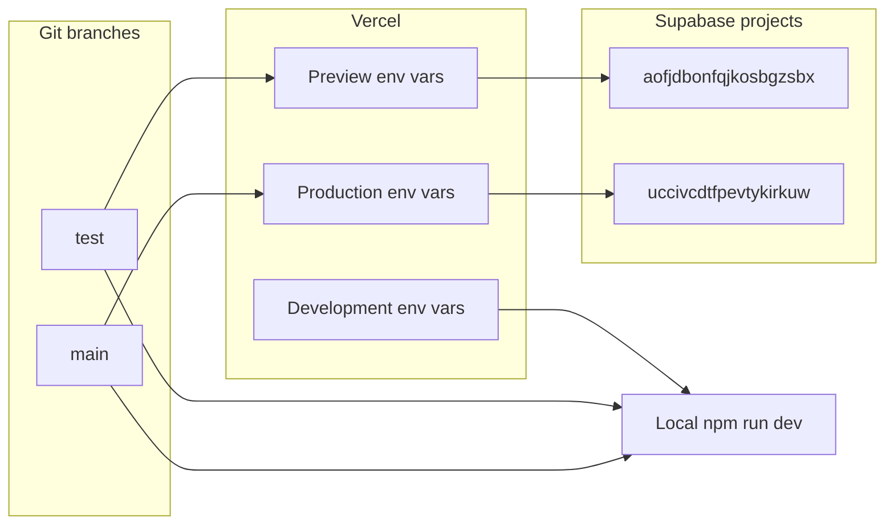

# Branch environments — TEST vs PROD

Canonical reference for humans and AI agents. Git branches map to Vercel deployment scopes, Supabase projects, page title prefixes, and Vercel Flags.

---

## Environment matrix

| Context | Git branch | Vercel scope | Public URL | Supabase project ref | Browser title prefix | Vercel Flags |
|---------|------------|--------------|------------|----------------------|----------------------|--------------|
| **TEST** | `test` | Preview | `https://jobboard-sand.vercel.app/` | `aofjdbonfqjkosbgzsbx` | `[TEST] ` | Preview `FLAGS` / `FLAGS_SECRET` |
| **PROD** | `main` | Production | Production domain (`NEXT_PUBLIC_SITE_URL` in Vercel Production) | `uccivcdtfpevtykirkuw` | _(none)_ | Production `FLAGS` / `FLAGS_SECRET` |
| **Local** | `test` or `main` | Development (flags only) | `http://localhost:3000` | Active branch selects project | `[TEST] ` on `test`, none on `main` | Development `FLAGS` / `FLAGS_SECRET` |



---

## Agent quick rules

1. **On branch `test`**, never assume production data — queries hit `aofjdbonfqjkosbgzsbx`.
2. **On branch `main`**, migrations and Edge Function deploys from pre-commit target `uccivcdtfpevtykirkuw` (production).
3. **Locally**, `npm run vercel:env` and pre-commit always pull **Development** Vercel Flags — not Preview or Production flag values.
4. **`NEXT_PUBLIC_TITLE_PREFIX`** drives the `[TEST] ` browser/social title prefix via `src/lib/page-title.ts` — do not hardcode `[TEST]` in page metadata.
5. **Cursor MCP** (`.cursor/mcp.json`) is wired to the **TEST** Supabase project (`aofjdbonfqjkosbgzsbx`).
6. **Schema changes** must be applied to **both** Supabase projects when shipping migrations (test first, then main).

---

## Local env files (layered)

Three gitignored files plus one composed output:

| File | Purpose | Committed template |
|------|---------|-------------------|
| **`.env.local`** | Shared tooling on your machine (CLI token, Development flags, localhost URL) | `.env.local.example` |
| **`.env.test`** | TEST Supabase + `[TEST]` title prefix (branch `test`) | `.env.test.example` |
| **`.env.prod`** | PROD Supabase (branch `main`) | `.env.prod.example` |
| **`.env`** | **Generated** — do not edit; composed by `npm run env:sync` | _(none — auto-written)_ |

Setup:

```bash
cp .env.local.example .env.local
cp .env.test.example   .env.test
cp .env.prod.example   .env.prod
# fill in values (see checklist below)
npm run env:sync       # writes .env from .env.local + .env.test|.env.prod
```

`npm run vercel:env` merges Development `FLAGS` / `FLAGS_SECRET` into **`.env.local`**, then runs `env:sync`.

Override branch detection: `SUPABASE_ENV=test` or `SUPABASE_ENV=main`.

### What to fill in — `.env.local`

| Variable | Required | Where to get it |
|----------|----------|-----------------|
| `NEXT_PUBLIC_SITE_URL` | Yes | Keep `http://localhost:3000` for `npm run dev` |
| `SUPABASE_ACCESS_TOKEN` | Yes (pre-commit deploy/migrate) | [Supabase → Account → Access Tokens](https://supabase.com/dashboard/account/tokens) |
| `FLAGS` | Optional | `npm run vercel:env` after `npx vercel link` |
| `FLAGS_SECRET` | Optional | Same as `FLAGS` |
| `NEXT_PUBLIC_VAPID_PUBLIC_KEY` | Optional | Supabase Edge secrets / Web Push setup |
| `E2E_TEST_EMAIL` / `E2E_TEST_PASSWORD` | Optional | Test user for E2E suite |
| `RESEND_*` | Optional | Local reference only — production mail uses Edge secrets |

### What to fill in — `.env.test`

| Variable | Required | Where to get it |
|----------|----------|-----------------|
| `NEXT_PUBLIC_SUPABASE_URL` | Yes | `https://aofjdbonfqjkosbgzsbx.supabase.co` |
| `NEXT_PUBLIC_SUPABASE_ANON_KEY` | Yes | Supabase Dashboard → project **aofjdbonfqjkosbgzsbx** → Settings → API |
| `SUPABASE_DB_PASSWORD` | Yes (migrations on `test`) | Same project → Settings → Database |
| `NEXT_PUBLIC_TITLE_PREFIX` | Yes | `[TEST]` |

Mirror these in **Vercel → Preview** scope (plus `NEXT_PUBLIC_SITE_URL=https://jobboard-sand.vercel.app/`).

### What to fill in — `.env.prod`

| Variable | Required | Where to get it |
|----------|----------|-----------------|
| `NEXT_PUBLIC_SUPABASE_URL` | Yes | `https://uccivcdtfpevtykirkuw.supabase.co` |
| `NEXT_PUBLIC_SUPABASE_ANON_KEY` | Yes | Supabase Dashboard → project **uccivcdtfpevtykirkuw** → Settings → API |
| `SUPABASE_DB_PASSWORD` | Yes (migrations on `main`) | Same project → Settings → Database |

Do **not** set `NEXT_PUBLIC_TITLE_PREFIX`. Mirror values in **Vercel → Production** scope.

---

## Pre-commit hook (`.githooks/pre-commit`)

| Step | Action | Branch target |
|------|--------|---------------|
| 0 | `node scripts/sync-branch-environment.js` | Compose `.env` from `.env.local` + branch file |
| 1 | `npm run codegen` | Types from branch `SUPABASE_PROJECT_ID` |
| 2 | `vercel env pull --environment=development` → merge `.env.local` | Development flags only |
| 3 | `node scripts/sync-branch-environment.js` again | Re-compose `.env` |
| 4 | `npm run build` | — |
| 5 | Deploy changed Edge Functions | `test` → `aofjdbonfqjkosbgzsbx`; `main` → `uccivcdtfpevtykirkuw` |
| 6 | Push staged migrations | Same project as step 5 |

Opt-outs: `SKIP_ENV_SYNC=1`, `SKIP_CODEGEN=1`, `SKIP_VERCEL_ENV_PULL=1`, `SKIP_BUILD=1`, `SKIP_DEPLOY=1`, `SKIP_MIGRATIONS=1`, or `git commit --no-verify`.

**After merge / branch switch (git hooks):**

| Hook | When | Action |
|------|------|--------|
| `post-merge` | `git pull` finishes a merge | `env:sync` → `npm run codegen` |
| `post-checkout` | `git checkout` switches branches | `env:sync` |

Hook opt-outs: `SKIP_ENV_SYNC=1`, `SKIP_CODEGEN=1`.

---

## Vercel dashboard checklist

Configure in **Vercel → Project → Settings → Environment Variables**.

### Preview (branch `test` deployments)

| Variable | Value |
|----------|-------|
| `NEXT_PUBLIC_SITE_URL` | `https://jobboard-sand.vercel.app/` |
| `NEXT_PUBLIC_SUPABASE_URL` | `https://aofjdbonfqjkosbgzsbx.supabase.co` |
| `NEXT_PUBLIC_SUPABASE_ANON_KEY` | _(TEST anon key)_ |
| `NEXT_PUBLIC_TITLE_PREFIX` | `[TEST]` |
| `FLAGS` | Preview-scoped value (auto when using Vercel Flags) |
| `FLAGS_SECRET` | Preview-scoped secret (**Sensitive**) |

### Production (branch `main`)

| Variable | Value |
|----------|-------|
| `NEXT_PUBLIC_SITE_URL` | _(production domain)_ |
| `NEXT_PUBLIC_SUPABASE_URL` | `https://uccivcdtfpevtykirkuw.supabase.co` |
| `NEXT_PUBLIC_SUPABASE_ANON_KEY` | _(PROD anon key)_ |
| `FLAGS` | Production-scoped value |
| `FLAGS_SECRET` | Production-scoped secret (**Sensitive**) |

Do **not** set `NEXT_PUBLIC_TITLE_PREFIX` on Production.

### Development (local `vercel env pull`)

| Variable | Value |
|----------|-------|
| `FLAGS` | Development-scoped value |
| `FLAGS_SECRET` | Development secret |

Supabase URL/keys for Development scope are optional — local active values come from `env:sync` + dual `.env` keys.

### Flags CLI (per scope)

```bash
vercel flags enable favourites -e preview
vercel flags enable favourites -e production
vercel flags list -e development
```

Use **separate** `FLAGS_SECRET` values per scope. See `.agents/skills/flags-sdk/SKILL.md`.

---

## Supabase Edge Function secrets

Each Supabase project has its **own** Dashboard → Edge Functions → Secrets. Set on **both** projects:

| Secret | Used by |
|--------|---------|
| `SUPABASE_SERVICE_ROLE_KEY` | Notification dispatchers, cron functions |
| `CRON_SECRET` | Scheduled Edge Functions |
| `RESEND_API_KEY` / `RESEND_FROM` | Email channel |
| `NEXT_PUBLIC_SITE_URL` | Link builders in emails |
| `VAPID_PRIVATE_KEY` / `VAPID_SUBJECT` | Web Push |

On TEST, use the sandbox site URL (`https://jobboard-sand.vercel.app/`). On PROD, use the production domain.

Pre-commit deploys Edge Functions only to the **branch-matched** project.

---

## Page title prefix

Implemented in [`src/lib/page-title.ts`](../src/lib/page-title.ts):

- `getPageTitlePrefix()` — reads `NEXT_PUBLIC_TITLE_PREFIX`
- `formatPageTitle(title)` — prepends prefix for full titles
- `buildTitleTemplate(brandName)` — root layout `%s | Brand` template
- `withTitlePrefix(metadata)` — wraps `generateMetadata` return values

Preview Vercel env sets `NEXT_PUBLIC_TITLE_PREFIX=[TEST]`. Local `env:sync` on branch `test` does the same.

---

## Related docs

- [`AGENTS.md`](../AGENTS.md) — secrets table, Edge Functions inventory
- [`README.md`](../README.md) — onboarding
- [`src/AGENTS.md`](../src/AGENTS.md) — code conventions
- [`src/PATTERNS.md`](../src/PATTERNS.md) — page-title pattern index
